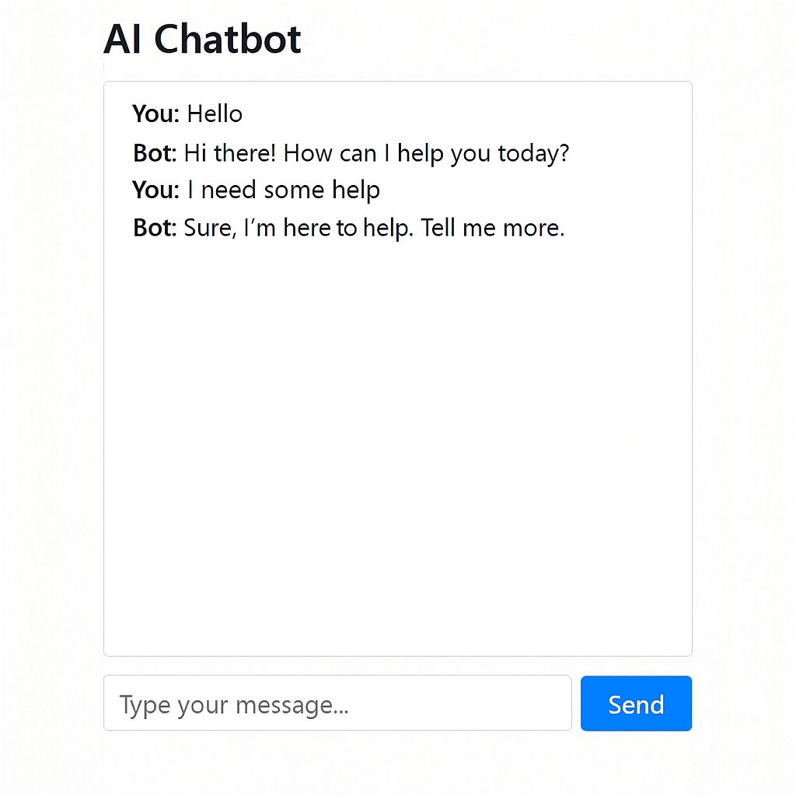

# 💬 AI-Powered Chatbot using Flask & NLTK

This is a simple AI-based chatbot built using Python, Flask, and NLTK. The chatbot responds to user queries with predefined logic, and runs on a minimal web interface.

---

## 🚀 Features

- Web-based chatbot interface
- Handles simple conversations using NLTK
- Flask-powered lightweight backend
- Easy to customize or expand
- Logs and handles requests using AJAX

---

## 🛠️ Tech Stack

- **Python 3.8+**
- **Flask**
- **NLTK (Natural Language Toolkit)**
- HTML, CSS, JavaScript (for frontend)

---

## 📂 Project Structure

```
AI_Chatbot/
├── app.py                   # Main Flask app
├── requirements.txt         # All dependencies
├── templates/
│   └── index.html           # Chatbot UI
├── chatbot/
│   ├── bot.py               # Chat logic
│   └── __init__.py
└── README.md
```

---

## 🖥️ How to Run the Project

1. **Clone the repo** or extract the folder  
   ```
   git clone https://github.com/yourusername/AI_Chatbot.git
   cd AI_Chatbot
   ```

2. **(Optional)** Create a virtual environment
   ```bash
   python -m venv venv
   venv\Scripts\activate  # On Windows
   ```

3. **Install required packages**
   ```bash
   pip install -r requirements.txt
   ```

4. **Download NLTK tokenizer (once)**
   ```python
   import nltk
   nltk.download('punkt')
   ```

5. **Run the Flask app**
   ```bash
   python app.py
   ```

6. **Open in your browser**
   ```
   http://127.0.0.1:5000/
   ```

---

## 🖼️ Screenshots

### 💻 Chat UI



---

## 📌 To-Do (Optional Ideas)

- Add database support for chat history
- Connect to GPT or Hugging Face models
- Deploy on Heroku, Render, or PythonAnywhere

---

## 🤝 Contributing

Feel free to fork this repo, add new features, and create pull requests.

---
